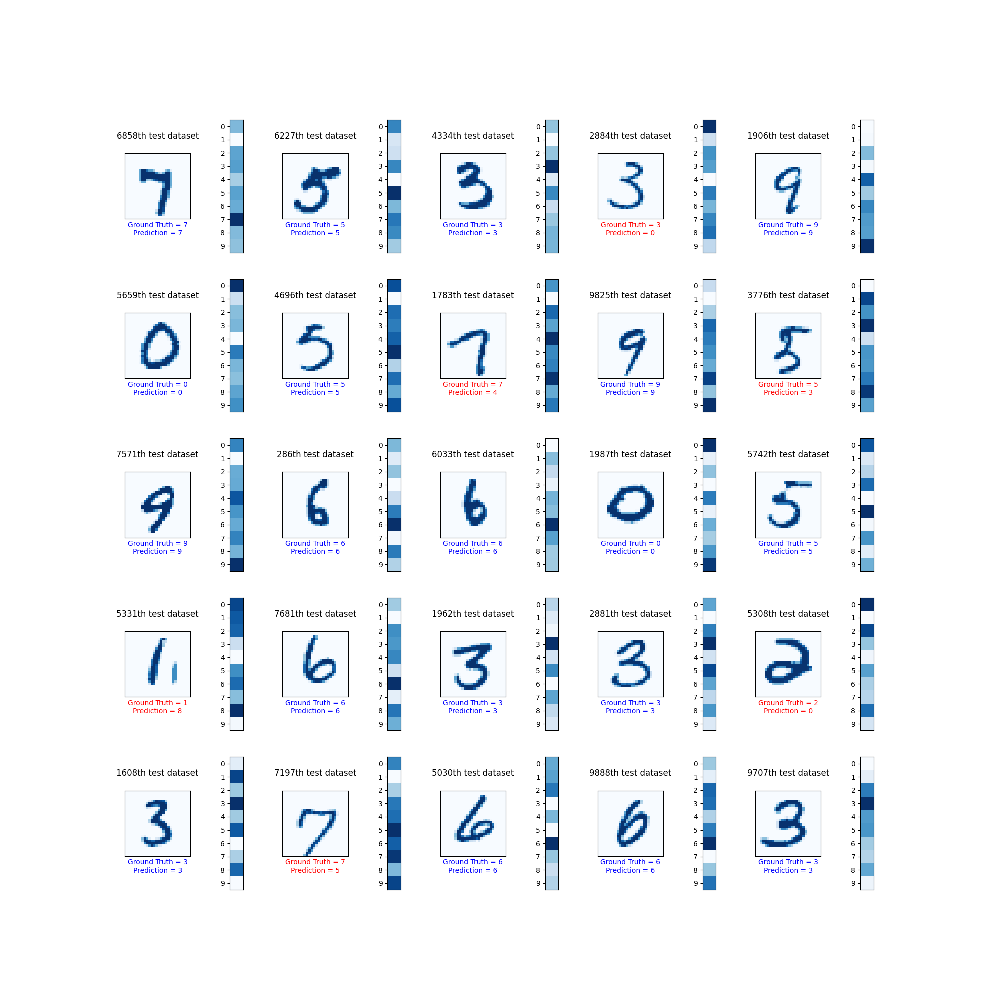

## Model architecture

    Simple MNIST handwritten digit dataset classifier

    1. Scaler with scale factor 0.00392156862745098
    2. Flattener                 : (28, 28) to 784

    3. Weights layer             : 784 to 400
    4. Biases layer              : 400
    5. ReLU Activation

    6. Weights layer             : 400 to 200
    7. Biases layer              : 200
    8. ReLU Activation

    9. Weights layer             : 200 to 100
    10. Biases layer              : 100
    11. ReLU Activation

    12. Weights layer             : 100 to 10
    13. Biases layer              : 10
    14. Softmax Activation, Activated:False

    Total parameters = 415310
    Loss function = Cross Entropy Loss Function from the logits

## Model's training

Learning rate = 0.01

Number of epochs = 40

### Model's loss graph

## Model's performance

